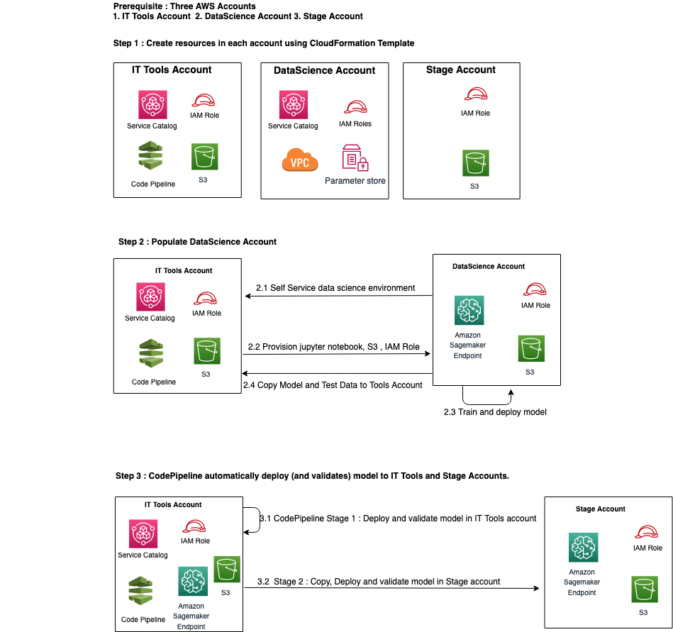

# Enable Self-Service to Data Scientists and integrate with automated MLOps pipelines

## Overview
[ABSTRACT]

## Terminologies

Few terminologies to get familiar with before we get started with lab provisioning:

* **Tools Account** - An AWS account managed by centrailized IT team, who are responsible for deploying the ML models to production through MLOps codepipeline.
* **Data Scientist Account** - An AWS account used by Data Scientists where they could deploy Sagemaker notebooks, run their modals and submit once approved.
* **Non Production Account** - An AWS account where the codepipeling deploys the models and validates the models before deploying in to production accint.
* **Production Account** - An AWS account where the production applications are hosted. MLOps codepipeline auto-deploy the models.

**Note:** For this lab we are combining Non Production Account and Production Account in to staging account. You expect to see total of THREE aws accounts.

This lab will build the following architecture

 

## Steps Involved

* **Step-1** Prepare the Lab environment  
    * Configure Service Catalog Product/Portfolio in the Tools Account and share it with a Spoke account.
    * Configure a Service Catalog Product/Portfolio and other networking resource in the Data Scientists account and allow access to Data Scientists user/role.
    * Configure Non prod/ prod accounts [Steps]
    * Configure MLOps pipeline in the Tools Account [Steps]
* **Step-2** Data scientists request for AWS resources  
    * Log in to the Data Scientists AWS account 
    * Go to AWS Service Catalog and launch the Sagemaker Notebook instance 
    * Use the Outputs from AWS Service Catalog and contiune with remaining work.
* **Step-3** Data scientists build/train the ML models and submit the final Model.
    * Steps to start a notebook
    * Steps to build/trian the ML model
    * Steps to submit the model to S3 bucket in Tools account

### Step-1 : Prepare the Lab environment

In this section we will deploy AWS Service Catalog portfolio in Tools account and share it with Data scientists account, allow Data scientists to launch SC resources, and setups the ML Codepiepline. For this lab, we will use CloudFormation to create all the required resources.  

#### Deploy AWS Service Catalog resources
##### Configuration on Tools Account
1. Log in to your assigned **Tools Account** using the *Lab Adminsitrator* credentials provided.
2. Copy and paste the below link in your web browser of your Tools Account
https://console.aws.amazon.com/cloudformation#/stacks/new?stackName=LabSCToolsAccountSetup&templateURL=https://marketplace-sa-resources.s3.amazonaws.com/scmlops/prepare_tools_account.yaml
3. In **Create stack** page, choose **Next**
4. In **Specify stack details** page, Type in your *Data Scientists Account Id* under **SpokeAccountID** 
5. In **Configure stack options** page, leave the defaults and choose **Next**
6. Scroll down **Review LabSCToolsAccountSetup** page to review the selections and choose **Create stack**
7. Wait for the stack to deploy resource completely.
8. Choose **Outputs** section and note down the values of **MasterPortfolioId** and **SagemakerProductID**. You will use this information in next step.

9. Go to [Service Catalog Console](https://console.aws.amazon.com/servicecatalog/) and choose **Portfolios** and **Data Scientists - Sample Portfolio**
10. Choose **Share(1)** to list the accounts the portfolio is shared with. In this case it will be the *SpokeAccountID* that you provided as input parameter.

##### Configuration on Data Scientists Account
11. Log in to your assgined **Data Scientists Account** using the *Lab Administrator* credentails provided.
12. Copy and paste the below link in your web browser
https://console.aws.amazon.com/cloudformation#/stacks/new?stackName=LabDSAccountSCSetup&templateURL=https://marketplace-sa-resources.s3.amazonaws.com/scmlops/prepare_datascientist_account.yaml
13. In **Create stack** page, choose **Next**
14. Key in the **MasterPortfolioId** and **SagemakerProductID** you noted in Step 8 and choose **Next**.
15. In **Configure stack options** page, leave the defaults and choose **Next**
16. Scroll down **Review LabDSAccountSCSetup** page and select **I acknowledge that AWS CloudFormation might create IAM resources** option and choose **Create stack**
17. Check in the **Outputs** tab for Temperory cedentials to login as a Data Scientist.

#### Deploy Resources in Staging / Production Accounts

#### Deploy MLOps Codepipeline

### Step-2 : Data scientists request for AWS resources

#### Launch a Sagemaker notebook in Data Scientists account

#### Access Sagemaker notebook

### Step-3 : Data scientists build/train the ML models and submit the final Model.

#### Build/Train the models

#### Submit the job on completion

#### Walkthrough  of the Codepipeline

## Conclusion

---
### !!!!!! WorkLog : Will be removed later

2.3 Upload lambda zip files to the S3 bucket created in 2.2

* tools-account/lambda-code/MLOps-BIA-DeployModel.py.zip
* tools-account/lambda-code/MLOps-BIA-GetStatus.py.zip
* tools-account/lambda-code/MLOps-BIA-EvaluateModel.py.zip
* tools-account/lambda-code/MLOps-BIA-TrainModel.py.zip
 
2.4 Launch CloudFormation Stack

aws cloudformation deploy --stack-name pre-reqs  --template-file ToolsAcct/pre-reqs.yaml --profile mlops-tools-user 

3. Prepare the Data Science account.Datascience / Dev Account
(Note : Resources below will be created by the ServiceCatalog in the workshop.  For
now using a cloudformation template)

3.1 Launch the cloudformation template to launch these resources
S3 bucket; Name - datascience; folders - data, models/development, models/release

SageMaker notebook

3.2 
3.3 Upload the python code.
3.4 Copy over the model (and data?? from datascience account??)

