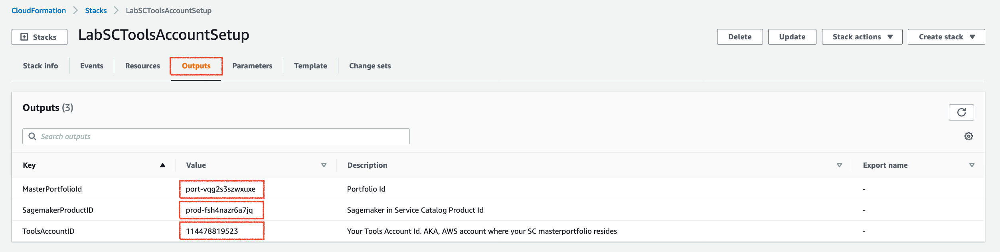

# Enable Self-Service to Data Scientists and integrate with automated MLOps pipelines

## Overview
[ABSTRACT]

## Terminologies

Few terminologies to get familiar with before we get started with lab provisioning:

**Tools Account** - An AWS account managed by a centralized IT team, who are responsible for deploying the ML models to production through MLOps code pipeline.
**Data Scientist Account** - An AWS account used by Data Scientists where they could deploy Sagemaker notebooks, run their models, and submit once approved.
**Non-Production Account** - An AWS account where the code pipeline deploys and validates the models before deploying into a production account.
**Production Account** - An AWS account where the production applications run. MLOps code pipeline auto-deploy the models.

**Note:** For this lab, we are combining the Non-Production Account and Production Account and call it as staging account. You expect to see a total of ***THREE aws accounts***.

This lab will build the following architecture

 

## Steps Involved

**Step-1:** Prepare the Lab environment 
* Configure Service Catalog Product/Portfolio in the Tools Account and share it with a Spoke account.
* Configure a Service Catalog Product/Portfolio and other networking resources in the Data Scientists account and allow access to Data Scientists user/role.
* Configure Non-prod/ prod accounts [Steps]
* Configure MLOps pipeline in the Tools Account [Steps]

**Step-2:** Data scientists request for AWS resources 
* Log in to the Data Scientists AWS account
* Go to AWS Service Catalog and launch the Sagemaker Notebook instance
* Use the Outputs from AWS Service Catalog and continue with remaining work.

**Step-3:** Data scientists build/train the ML models and submit the final Model.
* Steps to start a notebook
* Steps to build/train the ML model
* Steps to submit the Model to S3 bucket in Tools account

### Step-1 : Prepare the Lab environment

In this section, we will deploy the AWS Service Catalog portfolio in Tools account and share it with the Data scientists account, allow Data scientists to launch SC resources, and setups the ML Codepiepline. For this lab, we will use CloudFormation to create all the required resources.  

#### Deploy AWS Service Catalog resources
##### Configuration on Tools Account
1.1. Log in to your assigned **Tools Account** using the  credentials provided by your Lab Administrator.

1.2. Copy and paste the below link in your web browser of your Tools Account
https://us-east-2.console.aws.amazon.com/cloudformation#/stacks/new?stackName=LabSCToolsAccountSetup&templateURL=https://marketplace-sa-resources.s3.amazonaws.com/scmlops/prepare_tools_account.yaml

1.3. In **Create stack** page, choose **Next**

1.4. In **Specify stack details** page, Type in your *Data Scientists Account Id* under **SpokeAccountID** 

1.5. In **Configure stack options** page, leave the defaults and choose **Next**

1.6. Scroll down **Review LabSCToolsAccountSetup** page to review the selections and choose **Create stack**

1.7. Wait for the stack to deploy resource completely.

1.8. Choose **Outputs** section and note down the values of **MasterPortfolioId** and **SagemakerProductID**. You will use this information in next step.

1.9. Go to Service Catalog Console - https://us-east-2.console.aws.amazon.com/servicecatalog/ and choose **Portfolios** and **Data Scientists - Sample Portfolio**

1.10. Choose **Share(1)** to list the accounts the portfolio is shared with. In this case it will be the *SpokeAccountID* that you provided as input parameter.

##### Configuration on Data Scientists Account
1.11. Log in to your assgined **Data Scientists Account** using the *Lab Administrator* credentails provided.

**PLEASE READ:** Service Catalog is a regional service. Please make sure you are in the same region where you shared the portfolio from in above section.

1.12. Copy and paste the below link in your web browser
https://us-east-2.console.aws.amazon.com/cloudformation#/stacks/new?stackName=LabDSAccountSCSetup&templateURL=https://marketplace-sa-resources.s3.amazonaws.com/scmlops/prepare_datascientist_account.yaml

1.13. In **Create stack** page, choose **Next**

1.14. Key in the **MasterPortfolioId** and **SagemakerProductID** you noted in Step 8 and choose **Next**.

1.15. In **Configure stack options** page, leave the defaults and choose **Next**

1.16. Scroll down **Review LabDSAccountSCSetup** page and select **I acknowledge that AWS CloudFormation might create IAM resources** option and choose **Create stack**

1.17. Check in the **Outputs** tab, and note down the **SwitchRoleLink** role. You will use the URL link value to switch role as Data Scientist in Step-2 below.

#### Deploy Resources in Staging / Production Accounts

#### Deploy MLOps Codepipeline

### Step-2 : Data scientists request for AWS resources

In this section, you will login in as a **Data Scientist** and launch a Secure Sagemaker Notebook from the self-service portal powered by AWS Service Catalog.

#### Launch a Sagemaker notebook in Data Scientists account
2.1. Log in to the **Data Scientists** account using the same credentials as you used in step 1.11

2.2. Switch to **Data Scientist** role, using the URL you copied in Step 1.17

2.3. Under **Find services**, search and choose for **Service Catalog**  

2.4. Now you will see a "Amazon Secure Sagemaker" product under **Products list**. 

**PS:** If you don't see a product in your page, ensure you were able to switch the role properly and also in correct region. You can get this information from the ***top-right corner*** of the page.

2.5. Choose the product and click on **LAUNCH PRODUCT** button

2.6. Under **Product version** page, enter a name for your service catalog product and choose **NEXT**

2.7. Select **SagemakerInstance** notebook instance size and select a team name **TeamName**

2.8. In TagOptions page, select a **Value** from drop-down for tag **cost-center** and choose **NEXT**

2.9. Leave defaults in **Notifications** page and choose **NEXT**

2.10. Under **Review** page, review all the options selected and choose **LAUNCH**

2.11. On sucessful completion of the SC product launch, the Data scientist can get the notebook access information on **Outputs** page of the provisioned product (as shown below).

2.12. Click on **SageMakerNoteBookURL** to open the Notebook interface on the console. Alternatively, Click on **SageMakerNoteBookTerminalURL** to open the Terminal.

#### Access Sagemaker notebook

### Step-3 : Data scientists build/train the ML models and submit the final Model.

#### Build/Train the models

#### Submit the job on completion

#### Walkthrough  of the Codepipeline

## Conclusion

---
### !!!!!! WorkLog : Will be removed later

2.3 Upload lambda zip files to the S3 bucket created in 2.2

* tools-account/lambda-code/MLOps-BIA-DeployModel.py.zip
* tools-account/lambda-code/MLOps-BIA-GetStatus.py.zip
* tools-account/lambda-code/MLOps-BIA-EvaluateModel.py.zip
* tools-account/lambda-code/MLOps-BIA-TrainModel.py.zip
 
2.4 Launch CloudFormation Stack

aws cloudformation deploy --stack-name pre-reqs  --template-file ToolsAcct/pre-reqs.yaml --profile mlops-tools-user 

3. Prepare the Data Science account.Datascience / Dev Account
(Note : Resources below will be created by the ServiceCatalog in the workshop.  For
now using a cloudformation template)

3.1 Launch the cloudformation template to launch these resources
S3 bucket; Name - datascience; folders - data, models/development, models/release

SageMaker notebook

3.2 
3.3 Upload the python code.
3.4 Copy over the model (and data?? from datascience account??)

